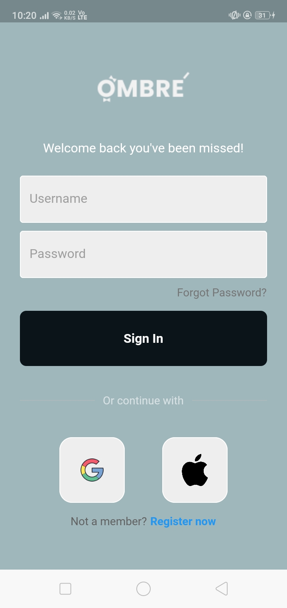
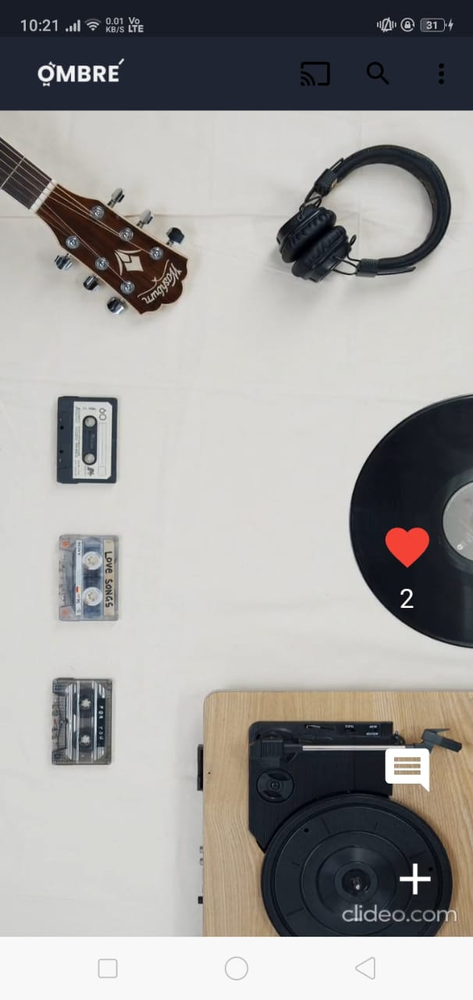
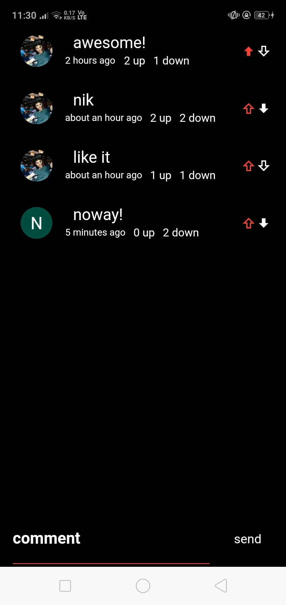
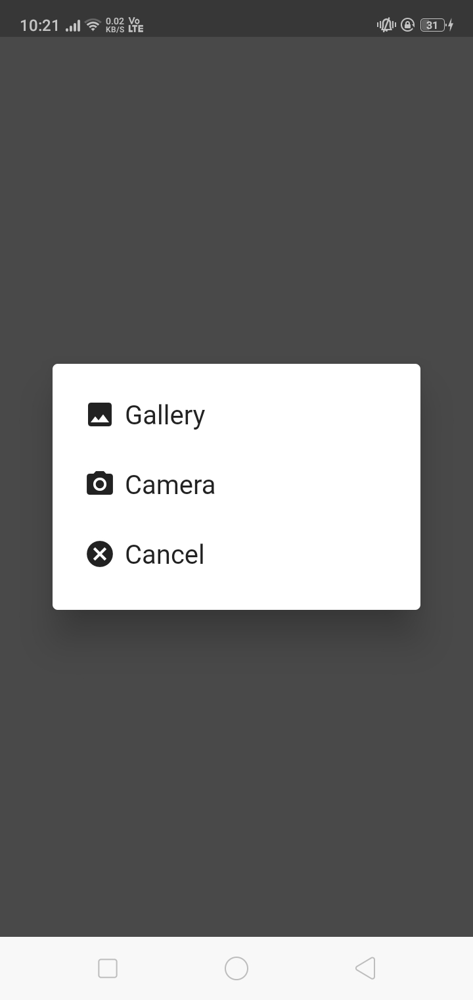
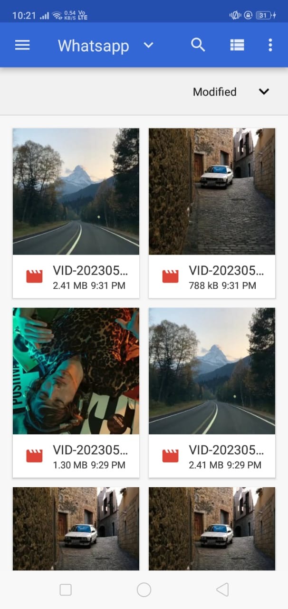
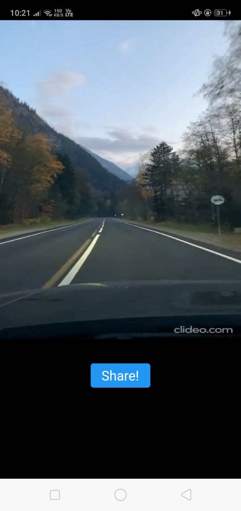

# ombrev

A new Flutter project.

## Getting Started

This project is a starting point for a Flutter application.

A few resources to get you started if this is your first Flutter project:

- [Lab: Write your first Flutter app](https://docs.flutter.dev/get-started/codelab)
- [Cookbook: Useful Flutter samples](https://docs.flutter.dev/cookbook)

For help getting started with Flutter development, view the
[online documentation](https://docs.flutter.dev/), which offers tutorials,
samples, guidance on mobile development, and a full API reference.

-----------------------------------------------------------------------------------------------------
Instructions & brief about the ombreV App:- 

This Application is created by using Flutter framework for Frontend & Firebase as backend,
This Application is a short video app like Instagram reels or Tiktok. The
app allow users to browse short videos and record them. It has a unique modern interface
which reflects the essence, elegance and growth of the Company 'Ombre'. 

The video is stored in firebase storage
the likes, comments, upvotes & downvotes  are stored in cloud Firestore. 

this is UI interface of the app (google login)
1. click the google icon squareTile to login - use ur gmail id

2. A video screen shows the list of videos on Tapping, you can play & pause the video. You can scroll down for more videos,
there is a dot button at top right corner of appbar which shows a showDialog to Logout.

3. On the video there are several functionalities such as liking video, commenting video, adding new video by '+' button
 
4. On comment Screen you can comment, also you can upvote/downvote a comment by clicking on upvote and downvote button

5. on clicking '+' button at the bottom right corner of the screen you get add_video_screen which contains a button 'add video'

6. on clicking 'add video' button you get a showDialog which asks for browsing video from storage or record one to upload,

7. confirm screen to watch the selected video for upload,

